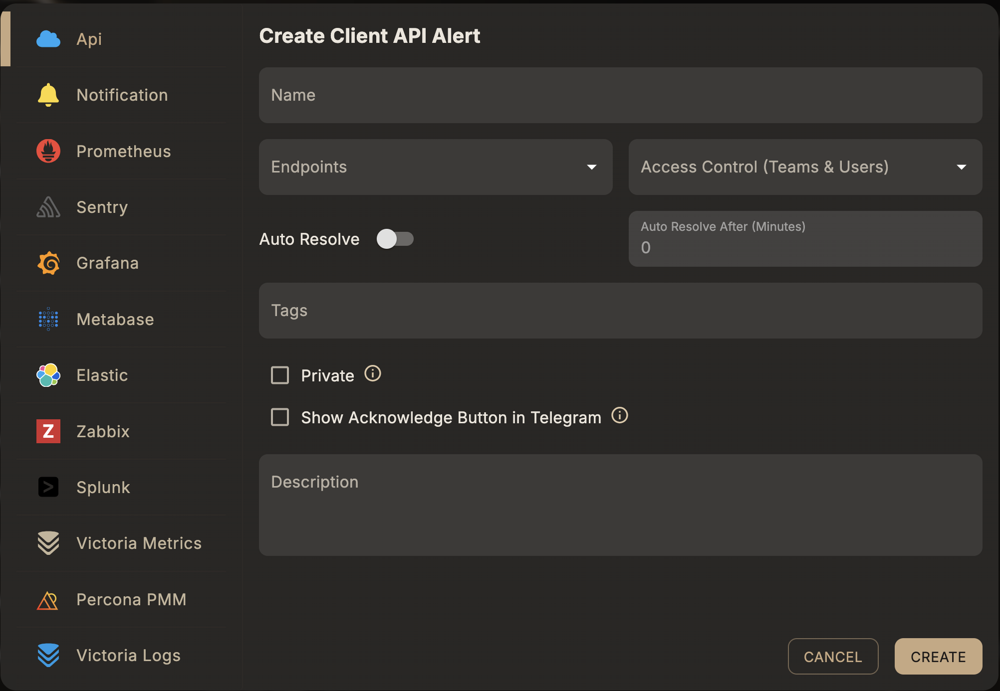

# API Alert

## Overview

The **API Alert** is a type of alert rule in Skylogs that maintains a state of firing or resolved for a specific name and instance. You can use this type of alert to directly fire and resolve an alert from your codebase. It's more common to set up alerting in front of your monitoring stack and use the API Alert only in exceptional cases.

You'll need:

* An API token (issued when creating alert rules)
* Your alert rules set up in the dashboard
* Endpoint configurations (SMS, Email, Telegram, Teams, etc.)

---

## 🔧 Creating an API Alert Rule

To begin, create an **Alert Rule** via the Skylogs web dashboard. Once created, you'll receive an **API token** which authorizes alert API usage.



---

## 🔔 Firing an Alert

Fire an alert by sending a POST request to the following endpoint:

```
POST https://mydomain.com/api/v1/fire-alert
```

### Headers

```
Authorization: Bearer <API_TOKEN>
Content-Type: application/json
```

### Body

```json
{
  "instance": "user-instance",
  "description": "an optional string"
}
```

* `instance` (required): A unique identifier for the alert instance.
* `description` (optional): Any additional context for the alert.

> 📝 Each fired instance is handled independently. Fire as many as you need, each with a unique `instance` ID.

---

## ✅ Resolving an Alert

Stop or resolve an active alert with:

```
POST https://mydomain.com/api/v1/stop-alert
```

### Headers

```
Authorization: Bearer <API_TOKEN>
Content-Type: application/json
```

### Body

```json
{
  "instance": "user-instance",
  "description": "an optional string"
}
```

* Use the same `instance` value you used to fire the alert.

> ⚠️ Each instance must be resolved separately.

---

## 📡 Endpoints for Notifications

You can set up various **notification endpoints** to be triggered when alerts fire or resolve. Supported types:

* 📩 Email
* 📞 Call
* 📬 SMS
* 📢 Telegram
* 👥 Microsoft Teams

These can be configured in the dashboard and attached to specific alerts.

---

## 👥 Shared Access & Customization

Skylogs encourages **collaboration**. You can:

* Add other **users** to an alert.
* Allow them to **attach their own endpoints** to receive notifications.
* Maintain **custom responsibility** over alert behavior per user.

> 🔐 Each user needs appropriate permissions to modify or observe alerts.

---

## 🧪 Example Use Case

Let’s say you manage a Kubernetes cluster:

1. Create an alert rule called `api-server-down`.
2. Fire an alert if the API server is unreachable.
3. Attach:

    * Your email and SMS endpoints
    * Your teammate adds a Telegram endpoint
4. Once resolved, call the stop alert endpoint.

---

## 📘 Best Practices

* Use meaningful `instance` names to trace issues easily.
* Stop every alert to maintain clean logs.
* Share alerts responsibly using Skylogs’ user-level control.

---

Built with ❤️ by the Skylogs Team
