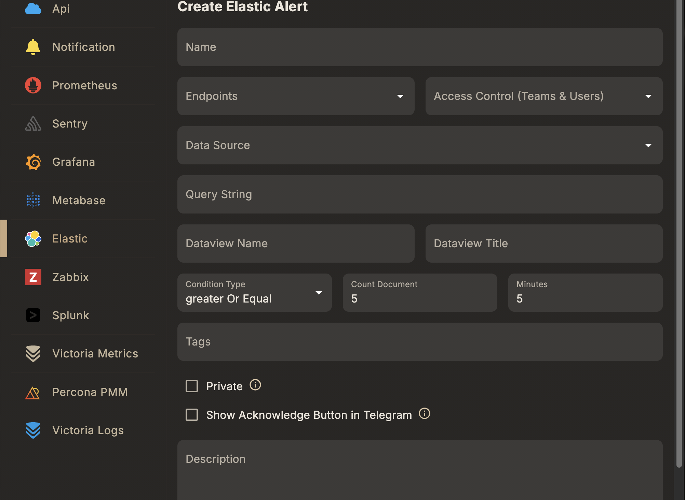

# Create an Elasticsearch Alert

An **Elastic alert rule** fires a document-count threshold check on an Elastic/ELK data view — for example, alerting when the number of 5xx responses or error log lines in a window exceeds a limit. It's a different shape from the Prometheus/Grafana/PMM rules: there's no dynamic/text-query choice, and no external ingestion webhook is required — Skylogs runs the check itself against the connected Elastic data source. (Kibana alerting can also push events in via a webhook connector, see [Elastic integration](/integrations/elastic), if you prefer Kibana to own the rule instead.)

## Before you start

1. Connect an Elastic/ELK data source in Skylogs.
2. Have at least one [notification endpoint](/integrations/endpoints) ready to attach.

## Steps

1. **Select the Alert Type** → *Elasticsearch*.
2. **Choose a Datasource** — the connected Elastic data source.
3. **Choose a Data View** and enter the query string to filter documents.
4. **Set the look-back window, condition, and document-count threshold**.
5. **Enter a Unique Alert Name**, assign **Endpoints**, and optionally add **Tags**.

## Fields

| Field | Type | Description |
|---|---|---|
| `dataSourceId` | string | Elastic data source id |
| `dataviewName` | string | Data view name, e.g. `responses` |
| `dataviewTitle` | string | Data view index pattern, e.g. `responses*` |
| `queryString` | string | Filter query, e.g. `OriginStatus:>=400` |
| `minutes` | integer | Look-back window in minutes, e.g. `15` |
| `conditionType` | string (`greaterOrEqual` \| `lessOrEqual`) | How `countDocument` is compared against the matched document count |
| `countDocument` | integer | Document count threshold, e.g. `5` |



## Example request

```json
{
  "type": "elastic",
  "name": "Elevated 5xx error rate",
  "description": "Fires when 5xx responses exceed threshold in a 15-minute window",
  "dataSourceId": "<elastic-datasource-id>",
  "dataviewName": "responses",
  "dataviewTitle": "responses*",
  "queryString": "OriginStatus:>=400",
  "minutes": 15,
  "conditionType": "greaterOrEqual",
  "countDocument": 5,
  "endpointIds": ["<endpoint-id>"],
  "tags": ["production", "errors"]
}
```

Sent to `POST /api/v1/alert-rule` — see the full field reference in [API reference → Alert rules](/api/alert-rules#post-api-v1-alert-rule).

## Notes

- The rule fires when the count of documents matching `queryString` within the last `minutes` satisfies `conditionType` against `countDocument`.
- Keep `queryString` narrow (index pattern + filter) so the count reflects the specific condition you're watching, not the data view's full volume.
