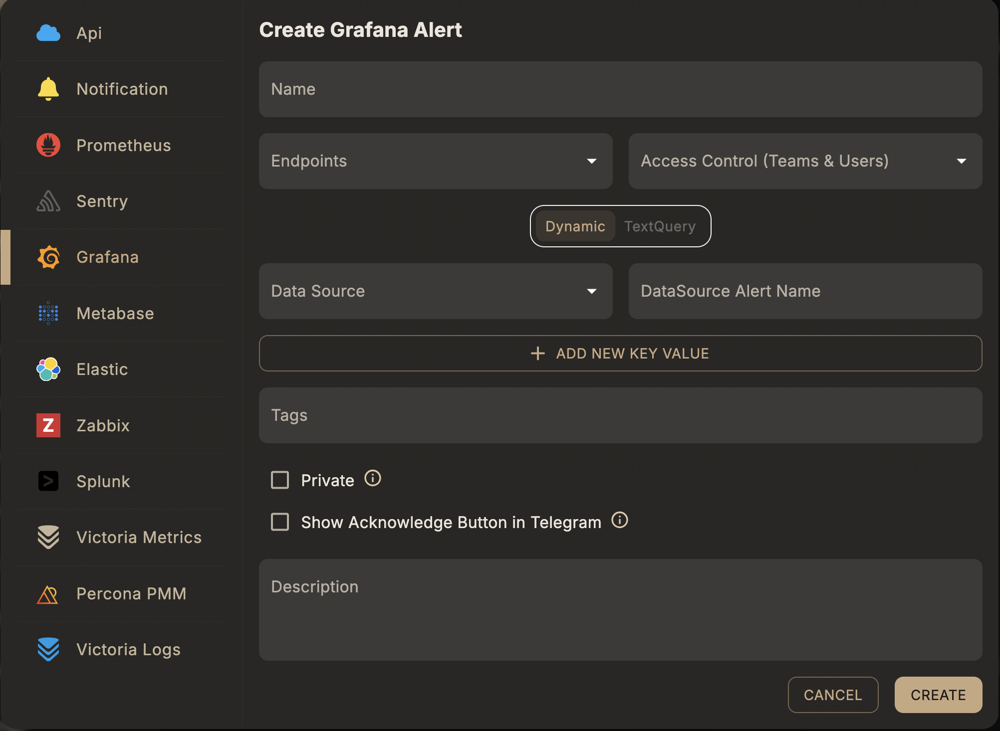

# Grafana Alert

A **Grafana alert rule** matches alerts coming from a connected Grafana instance. Alerts are ingested through the [Grafana integration](/integrations/grafana) (a webhook contact point); this rule tells Skylogs which of those incoming alerts belong to it.

## Before you start

1. Connect Grafana as a data source and point its webhook contact point at Skylogs — see [Grafana integration](/integrations/grafana).
2. Have at least one [notification endpoint](/integrations/endpoints) ready to attach.

## Steps

1. **Select the Alert Type** → *Grafana*.
2. **Choose a Datasource** — the connected Grafana instance this rule should match against.
3. **Choose a Query Type** — *Dynamic* or *Text Query* (see below).
4. **Enter a Unique Alert Name**, assign **Endpoints**, and optionally add **Tags**.

## Query types

### Dynamic

Matches by the alert name as it already exists in Grafana's own alert rules — pick it from the connected data source rather than writing a query. Best when your alerting rules are already defined and maintained in Grafana.

| Field | Type | Description |
|---|---|---|
| `dataSourceIds` | array of string | Grafana data source id(s) to match against |
| `dataSourceAlertName` | string | Alert name as defined in Grafana |
| `extraField` | array of object | Optional label key/value filters to narrow the match |

### Text query

Matches using a raw query evaluated by Skylogs' own checker instead of relying on an existing Grafana rule.

| Field | Type | Description |
|---|---|---|
| `queryText` | string | Query expression string |
| `queryObject` | object | Structured query payload used by the checker |



## Example request

Dynamic:

```json
{
  "type": "grafana",
  "queryType": "dynamic",
  "name": "Dashboard threshold breach",
  "description": "Fires when the Grafana alert rule triggers",
  "dataSourceIds": ["<grafana-datasource-id>"],
  "dataSourceAlertName": "HighMemory",
  "endpointIds": ["<endpoint-id>"],
  "tags": ["production", "grafana"]
}
```

Text query:

```json
{
  "type": "grafana",
  "queryType": "textQuery",
  "name": "Dashboard threshold breach",
  "description": "Fires when the Grafana alert rule triggers",
  "queryText": "<query expression>",
  "endpointIds": ["<endpoint-id>"],
  "tags": ["production", "grafana"]
}
```

Both are sent to `POST /api/v1/alert-rule` — see the full field reference in [API reference → Alert rules](/api/alert-rules#post-api-v1-alert-rule).

## Notes

- Resolved notifications from Grafana auto-resolve the corresponding Skylogs alert.
- Use **Dynamic** when you want Grafana's own alert rules to remain the source of truth; use **Text query** when you want Skylogs to evaluate the condition itself.
- Override the notification text per endpoint with a [custom notification template](/alert-management/notification-templates#grafana-and-pmm).
