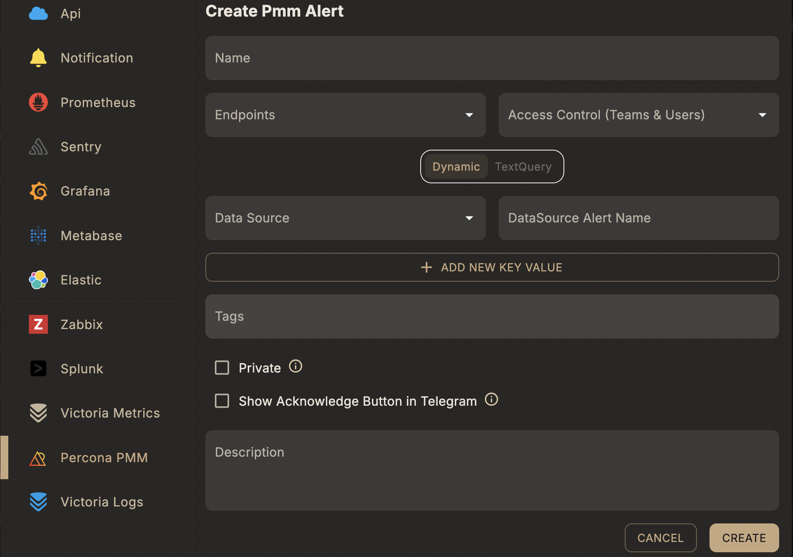

# Create a PMM Alert

## Overview

As with Grafana alerts, you can connect PMM alerts to Skylogs and manage them in a centralized panel.

A **PMM alert rule** matches alerts coming from a connected Percona Monitoring and Management (PMM) instance. PMM's alerting is Alertmanager-compatible and is ingested through the same receiver as [Prometheus & Alertmanager](/integrations/prometheus-alertmanager) — see [PMM integration](/integrations/pmm).

## Before you start

1. Configure PMM's alert settings to use the Skylogs Alertmanager receiver URL — see [PMM integration](/integrations/pmm).
2. Have at least one [notification endpoint](/integrations/endpoints) ready to attach.

## Steps

1. **Select the Alert Type** → *PMM*.
2. **Choose a Datasource** — the connected PMM instance this rule should match against.
3. **Choose a Query Type** — *Dynamic* or *Text Query* (see below).
4. **Enter a Unique Alert Name**, assign **Endpoints**, and optionally add **Tags**.

## Query types

### Dynamic

Matches by the alert name as it already exists in PMM's own alert rules — pick it from the connected data source rather than writing a query. Best when your alerting rules are already defined and maintained in PMM.

| Field | Type | Description |
|---|---|---|
| `dataSourceIds` | array of string | PMM data source id(s) to match against |
| `dataSourceAlertName` | string | Alert name as defined in PMM |
| `extraField` | array of object | Optional label key/value filters to narrow the match |

### Text query

Matches using a raw query evaluated by Skylogs' own checker instead of relying on an existing PMM rule.

| Field | Type | Description |
|---|---|---|
| `queryText` | string | Query expression string |
| `queryObject` | object | Structured query payload used by the checker |



## Example request

Dynamic:

```json
{
  "type": "pmm",
  "queryType": "dynamic",
  "name": "Database replication lag",
  "description": "Fires when replication lag exceeds threshold",
  "dataSourceIds": ["<pmm-datasource-id>"],
  "dataSourceAlertName": "MySQLReplicationLag",
  "endpointIds": ["<endpoint-id>"],
  "tags": ["production", "database"]
}
```

Text query:

```json
{
  "type": "pmm",
  "queryType": "textQuery",
  "name": "Database replication lag",
  "description": "Fires when replication lag exceeds threshold",
  "queryText": "<query expression>",
  "endpointIds": ["<endpoint-id>"],
  "tags": ["production", "database"]
}
```

Both are sent to `POST /api/v1/alert-rule` — see the full field reference in [API reference → Alert rules](/api/alert-rules#post-api-v1-alert-rule).

## Notes

- Database-specific labels (service, node, cluster) are preserved as tags for routing — useful for giving each database team ownership of its own alerts.
- Use **Dynamic** when you want PMM's own alert rules to remain the source of truth; use **Text query** when you want Skylogs to evaluate the condition itself.
