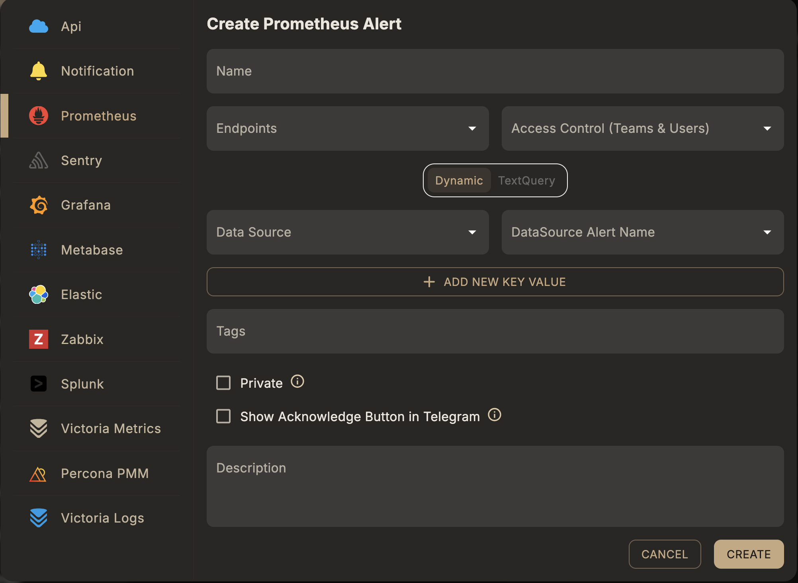

# Prometheus Alert

## Overview

The **Prometheus Alert** is a type of alert rule in Skylogs that connects to a Prometheus datasource or Alertmanager and retrieves the latest state of all alerts and their labels. You have strong label filtering to tune the rule to a specific alert and avoid generating noisy alerts.

A **Prometheus alert rule** matches alerts coming from a connected Prometheus / VictoriaMetrics data source. Alerts are ingested through the [Prometheus & Alertmanager integration](/integrations/prometheus-alertmanager); this rule tells Skylogs which of those incoming alerts belong to it.

## Before you start

1. Connect a Prometheus/VictoriaMetrics data source and confirm alerts are flowing in through [Alertmanager](/integrations/prometheus-alertmanager).
2. Have at least one [notification endpoint](/integrations/endpoints) ready to attach.

## Steps

1. **Select the Alert Type** → *Prometheus*.
2. **Choose a Datasource** — the Prometheus/VictoriaMetrics data source this rule should match against.
3. **Choose a Query Type** — *Dynamic* or *Text Query* (see below).
4. **Enter a Unique Alert Name**, assign **Endpoints**, and optionally add **Tags**.

## Query types

### Dynamic

Matches by the alert name as it already exists in the external Prometheus/VictoriaMetrics ruler — pick it from the connected data source rather than writing a query. Best when your alerting rules are already defined and maintained in Prometheus itself.

| Field | Type | Description |
|---|---|---|
| `dataSourceIds` | array of string | Prometheus data source id(s) to match against |
| `dataSourceAlertName` | string | Alert name in the external Prometheus ruler, e.g. `HighMemory` |
| `extraField` | array of object | Optional label key/value filters to narrow the match |

### Text query

Matches using a raw PromQL expression, evaluated by Skylogs' own checker instead of relying on an existing Prometheus rule.

| Field | Type | Description |
|---|---|---|
| `queryText` | string | PromQL expression string |
| `queryObject` | object | Structured query payload used by the checker |



## Example request

Dynamic:

```json
{
  "type": "prometheus",
  "queryType": "dynamic",
  "name": "High memory usage",
  "description": "Fires when node memory exceeds threshold",
  "dataSourceIds": ["<prometheus-datasource-id>"],
  "dataSourceAlertName": "HighMemory",
  "endpointIds": ["<endpoint-id>"],
  "tags": ["production", "memory"]
}
```

Text query:

```json
{
  "type": "prometheus",
  "queryType": "textQuery",
  "name": "High memory usage",
  "description": "Fires when node memory exceeds threshold",
  "queryText": "node_memory_MemAvailable_bytes / node_memory_MemTotal_bytes < 0.1",
  "endpointIds": ["<endpoint-id>"],
  "tags": ["production", "memory"]
}
```

Both are sent to `POST /api/v1/alert-rule` — see the full field reference in [API reference → Alert rules](/api/alert-rules#post-api-v1-alert-rule).

## Notes

- `dataSourceIds` can be left empty to match across all connected Prometheus sources.
- Use **Dynamic** when you want Prometheus's own ruler to remain the source of truth; use **Text query** when you want Skylogs to evaluate the condition itself.
