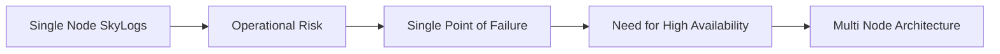
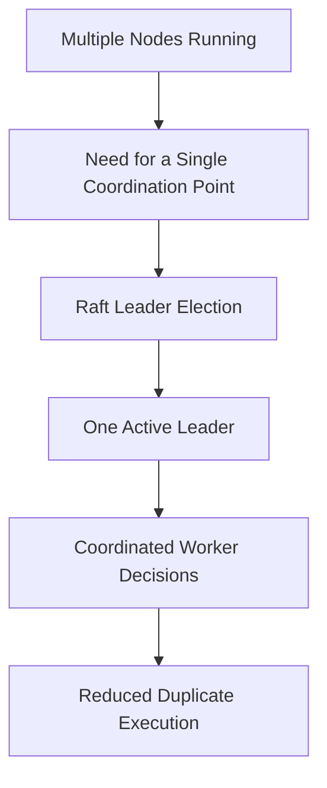
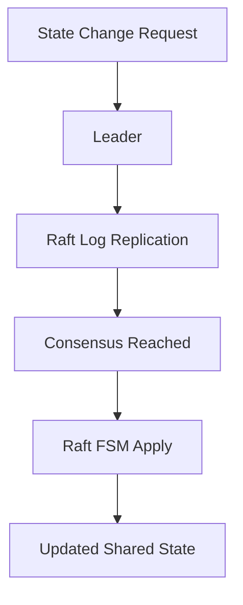
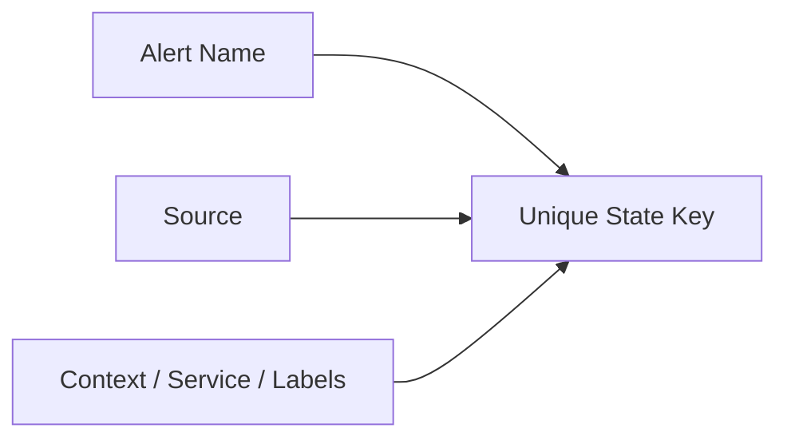
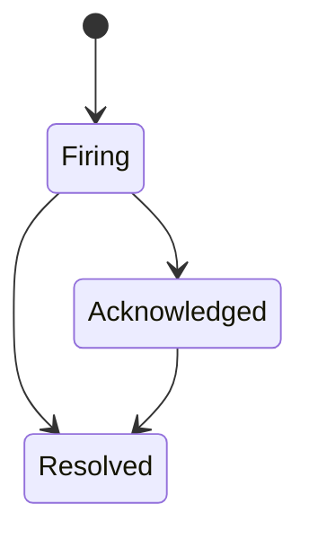
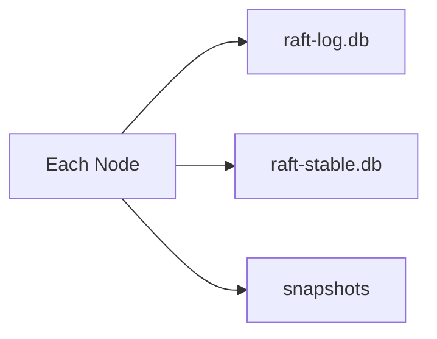
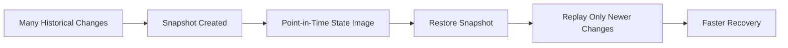
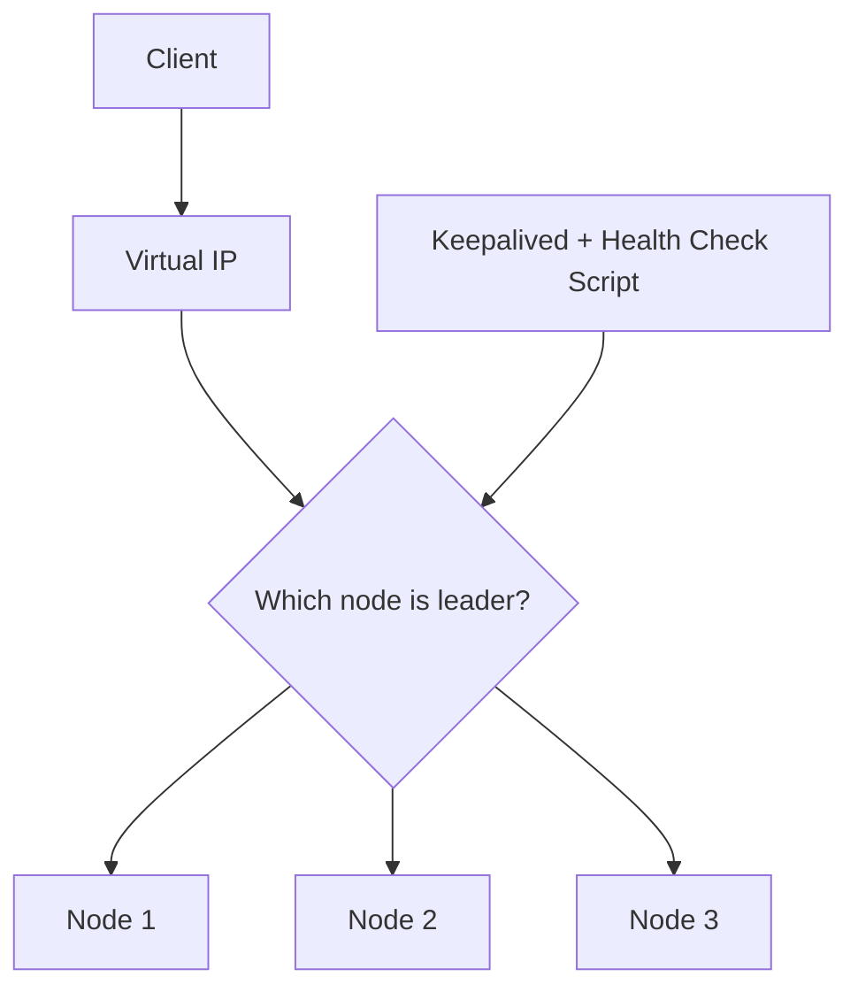
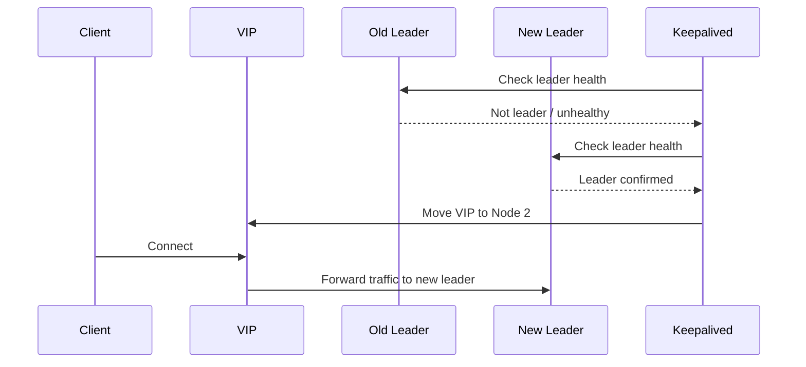
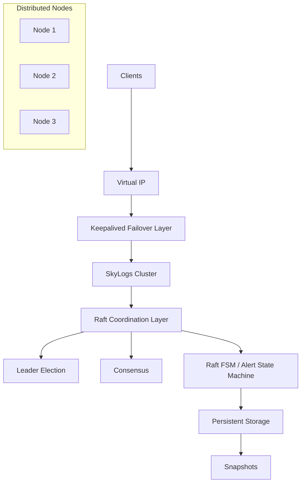

# Architecture

Skylogs is designed around a simple principle: **the incident platform is the last thing allowed to go down.** Most self-hosted alerting tools have a single point of failure — themselves. Skylogs removes it with two independent resilience layers.

The mental model:

> **HA inside the zone. Federation across zones.**

## The two layers

### High availability (Raft) — SkyLogs Distributed Coordination Architecture

> **Architecture overview for the distributed coordination layer used in SkyLogs**  
> This document explains **why** the coordination layer was introduced, **which problems** it solves, and **how** the design works at a conceptual level.

---

### 1. Introduction

SkyLogs is a platform for **monitoring**, **alert handling**, and **incident response**. In its early stages, the system could run as a **single-node application**. That model was simple and practical: one application instance handled the logic, kept the in-memory state, and served incoming requests.

That approach worked well at the beginning, but it introduced a serious limitation. As soon as SkyLogs became part of an operational environment, the system itself started to need **high availability**. A single-node deployment meant that if the host failed, critical capabilities such as **alert processing**, **internal coordination**, and parts of the **incident workflow** could become unavailable exactly when they were needed the most.

This was the starting point for the move toward a **multi-node architecture**. The goal was not simply to run more copies of the application, but to build a system that could **continue operating when one node fails**. That requirement led directly to a second and deeper problem: once multiple nodes exist, the platform needs a reliable way to decide **which node is responsible**, **which system state is valid**, and **how changes are applied consistently across the cluster**.

To solve that class of problems, SkyLogs introduced a **distributed coordination layer** built on top of **Raft**.

---

### 2. Why Multi-Node Was Needed

The initial problem was not “we want Raft.” The initial problem was that **a single server was not enough anymore**.

A single-node deployment creates a **single point of failure**. If that server crashes, restarts unexpectedly, loses connectivity, or becomes unhealthy under load, the platform may lose important operational functions. In a system that supports incident response, this is unacceptable because the system must remain available during infrastructure instability.

The natural solution was to move from a **Single Node** deployment to a **Multi Node** deployment.



However, moving to multiple nodes does not automatically create a correct distributed system. It only replaces one problem with a different and more complex one.

Once multiple nodes are running, each node may observe the world slightly differently. Without coordination, one node may believe an alert is still active while another believes it is resolved. One worker may process a task while another tries to process the same task at the same time. In other words, **availability alone is not enough**. The system also needs **consistency** and **coordination**.

That is the real reason the coordination layer exists.

---

### 3. Raft as the Coordination Mechanism

SkyLogs uses **Raft** as the underlying consensus mechanism for distributed coordination.

Raft is a consensus algorithm that allows a cluster of nodes to **agree on a shared state**, even when some nodes fail. In practice, this means the cluster can maintain a common and reliable view of important information instead of letting every node manage changes independently.

In SkyLogs, Raft is **not** the business layer and it is **not** responsible for the domain rules of alerting. Its role is much narrower and much more important at the infrastructure level: it provides a **reliable path for coordinated state changes**.

That choice gives SkyLogs three essential guarantees. First, there is a clear way to decide **which node currently acts as leader**. Second, important changes follow a **consistent order** across the cluster. Third, all nodes can rebuild the same view of the distributed state by replaying the same committed history.

> **In short:** SkyLogs uses Raft because a multi-node system needs a reliable way to coordinate changes, preserve ordering, and maintain a shared state.

---

### 4. Leader Election and Coordinated Responsibility

Once SkyLogs became a multi-node system, one of the first practical problems was deciding **who is responsible for coordinated work**.

This was especially important for background processing and worker-style behavior. Imagine several workers capable of processing alerts or running internal tasks. If all of them make decisions independently, the result can be duplicated work, conflicting updates, and unpredictable behavior.

A multi-node setup without leadership can quickly create situations where two workers both believe they should handle the same operation. That is not real availability; it is distributed confusion.

The solution is **leader election**. Raft ensures that at any given time, one node acts as the **leader** and the other nodes act as followers. The leader becomes the coordination point for operations that require a **cluster-wide decision**.



This does not mean followers are useless. It means they do not independently redefine the shared system state. Instead, they participate in the distributed system through the coordination model defined by Raft.

The key problem here was **unclear ownership of responsibility**. The solution was to allow the cluster to elect a leader so that coordinated decisions always have a single authoritative path.

---

### 5. Consensus and Shared System State

After deciding who is responsible for coordinated decisions, the next problem is deciding **how state changes become valid**.

In a distributed system, independent state changes are dangerous. If each node can directly modify critical state based on its own local view, the system eventually drifts into inconsistency. One node may consider an alert **resolved** while another still sees it as **firing**. At that point, the platform no longer has one reliable truth.

The solution is to ensure that important state changes do not happen through uncontrolled direct writes. Instead, state changes must go through a **coordinated path**.

In SkyLogs, the conceptual flow looks like this:



This design solves a very specific problem. The problem was that multiple nodes could otherwise apply conflicting updates. The solution is to route changes through the Raft coordination path so that only **committed**, **ordered**, and **cluster-approved** changes become part of the shared state.

That is how SkyLogs turns distributed uncertainty into a **single reliable system state**.

---

### 6. Alert State Management Through the Raft State Machine

One of the most important uses of this architecture in SkyLogs is the management of **alert state**.

An alert is not just a static record. It has a lifecycle. It appears, changes, may be acknowledged, and may eventually be resolved. In other words, alerts behave like stateful entities that move through a sequence of transitions.

The problem is that in a distributed environment, these transitions must be associated with the **correct logical alert instance**. An alert name alone is not always enough. The same alert name may appear from multiple sources, services, or contexts. If the system cannot uniquely identify which logical alert is being updated, then distributed state management becomes ambiguous.

The solution is to treat alert tracking as a **state machine** implemented through the **Raft FSM**. In practice, SkyLogs constructs a **unique state key** using a combination of identifying fields such as the alert name, the source, and other contextual fields.

Conceptually, the key structure looks like this:



That key becomes the reference to a specific logical alert state inside the system. Each update is not just a generic command; it is a **state transition** for a well-defined entity in the distributed state machine.

For example, a logical alert identified as:

```text
alert:web-down:prometheus
```

may move from **Firing** to **Resolved** over time. Because that transition is applied through the Raft state machine, every node in the cluster reaches the same final understanding of that alert.



The core problem here was ambiguity and inconsistency in alert identity and alert progression. The solution was to model alerts as **stateful entities** inside the **Raft state machine**, using **composed state keys** to identify each logical alert instance.

> **Important design note:** the state machine is not a separate external concept in this architecture; it is effectively part of the **Raft FSM layer** that applies distributed state transitions.

---

### 7. Persistent State on Every Node

A distributed system also needs to survive restarts and failures without losing its coordination state.

If the cluster state only lives in memory, then restarting a node means losing critical information. That would make recovery slow, error-prone, and in some cases impossible without manual intervention.

The solution is **local persistence on every node**. Each node stores the distributed coordination data it needs in persistent storage. In the SkyLogs project, this includes the Raft log, the stable state, and snapshots.



This design solves the problem of state loss after restart. Because every node keeps the persistent Raft data it needs, it can recover, rebuild its coordination state, and safely rejoin the cluster.

The important point is that persistence is not just an optimization. It is part of the reliability model.

---

### 8. Snapshot and Faster Recovery

Over time, the number of committed state changes increases. If a node had to replay the entire history from the very beginning every time it recovered, the process would become expensive and inefficient.

The problem, therefore, is **unbounded historical growth**. A long-running system accumulates many state transitions, and full replay eventually becomes too heavy as a recovery strategy.

The solution is to use **snapshots**. A snapshot represents a point-in-time image of the current Raft state machine. Instead of rebuilding everything from the full beginning, a recovering node can restore the latest snapshot and then apply only the more recent changes that happened after that snapshot.



This helps both performance and operational simplicity. It reduces recovery time, keeps replay manageable, and allows the system to remain efficient even as the distributed state history grows.

---

### 9. Network High Availability with Keepalived and VIP

After solving the internal coordination problem, another issue remained at the network level.

Even if the cluster internally knows which node is the current leader, clients and external components still need a reliable way to reach that active node. A leader change inside the cluster is not enough by itself if clients are still trying to talk to the old node.

That is the network-level high availability problem. Internally, the cluster may be healthy, but externally, traffic still needs to be routed to the correct place.

The solution is a **Virtual IP (VIP)** managed through **Keepalived**. Instead of forcing clients to know the current leader directly, clients connect to a stable virtual address. Keepalived continuously checks leader status through a health-check script and ensures that the VIP is attached to the node that should currently receive traffic.



When leadership changes, the VIP moves accordingly:



This solves an important operational gap. Raft tells the cluster **who the leader is**, while Keepalived and the VIP make that leadership **reachable in practice**.

---

### 10. Final Architecture Overview

The final architecture of the SkyLogs distributed coordination layer is built from several cooperating parts. Each one solves a different problem, and together they create a reliable distributed foundation.



The original problem was the limitation of a single-node deployment in a system that needed **availability**, **coordination**, and **state consistency**. Moving to multiple nodes solved the single point of failure problem, but it created new distributed systems problems. Those problems were solved by introducing a coordination layer based on **Raft**, modeling alert handling through the **Raft state machine**, persisting the distributed state on every node, accelerating recovery with **snapshots**, and solving network-level failover with **Keepalived** and a **Virtual IP**.

The result is a SkyLogs architecture that can move beyond a single-server model and operate as a **fault-tolerant distributed system** with a **shared, reliable, and recoverable state**.


Within a zone, Skylogs nodes form a cluster built on the **Raft consensus algorithm**. All critical state changes — alert status transitions, acknowledgments, escalation timer state, on-call assignments — are committed through a replicated log before they take effect, and every node holds an identical copy of critical state.

If the leader node fails, the remaining nodes elect a new leader within seconds and processing continues. No manual failover, no lost escalations, no dropped pages.

This layer is a **CP system**: it prioritizes consistency and requires a majority quorum (3 nodes tolerate 1 failure). It assumes low-latency links and must never be stretched across a WAN.

### Multi-zone federation (Sentinel) — across zones

Each zone runs a complete Skylogs deployment. Zones are connected by **Sentinel**, a lightweight Go service with two jobs:

1. **Heartbeat monitoring** — every zone continuously verifies the health of every other zone. If a zone goes dark, surviving zones detect it and can alert your team about the zone failure itself.
2. **Organizational data sync** — users, teams, endpoints, clusters, schedules, and escalation policies are replicated to all zones.

**Alert data is intentionally not replicated.** It stays in the zone that ingested it, so the zone closest to a failing system keeps ingesting, escalating, and notifying on its own data even when fully cut off from the rest of the world.

This layer is an **AP system**: it prioritizes availability. During a datacenter disaster or network partition, no zone ever waits for another zone's permission to page someone — and every surviving zone has the complete organizational context (who is on call, how to reach them) to run a full response alone.

## Why two separate layers?

Because the two problems demand opposite trade-offs. Strong consistency (Raft) requires a quorum — which is exactly what you *cannot* demand across datacenters, where a partition would take the minority side offline at the worst possible moment. Availability-first federation (Sentinel) tolerates partitions — but can't give the lost-page-is-unacceptable guarantees needed inside the escalation engine.

So the layers are strictly separated by design:

- A network partition between zones never blocks alerting inside a zone.
- A degraded Raft cluster inside a zone never stops the cross-zone heartbeat — other zones can still distinguish "zone degraded" from "zone destroyed."

This mirrors how mature infrastructure is built (e.g., Kubernetes runs etcd per cluster and treats cross-cluster federation as a separate, looser layer).

## Deployment topologies

| Topology | Protects against | Minimum footprint |
|---|---|---|
| Single node | — (evaluation only) | 1 server |
| HA cluster | Server failure within a zone | 3 servers, one zone |
| Multi-zone | Datacenter/region failure | 2 zones × 1 server |
| Multi-zone + HA | Both | 2–3 zones × 3 servers |

Setup instructions, failure behavior, and the production checklist are in [Deployment](/deployment).
