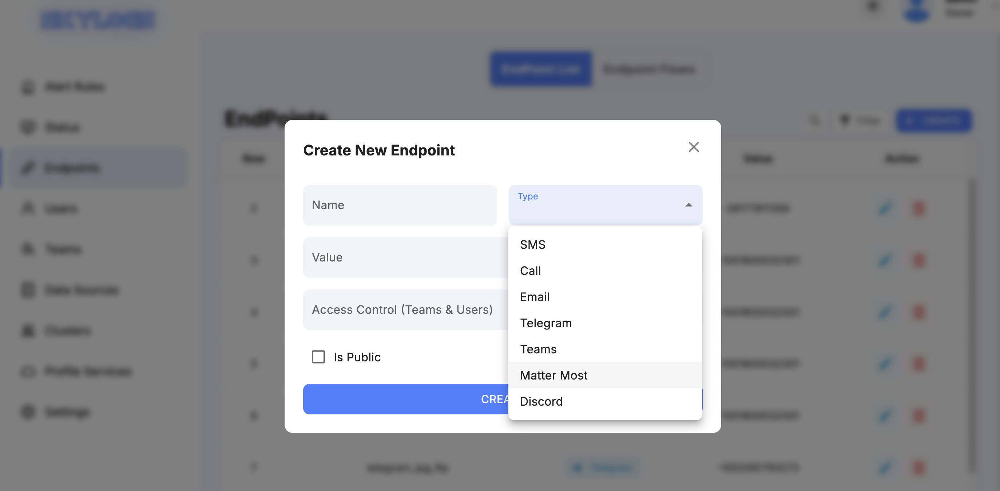
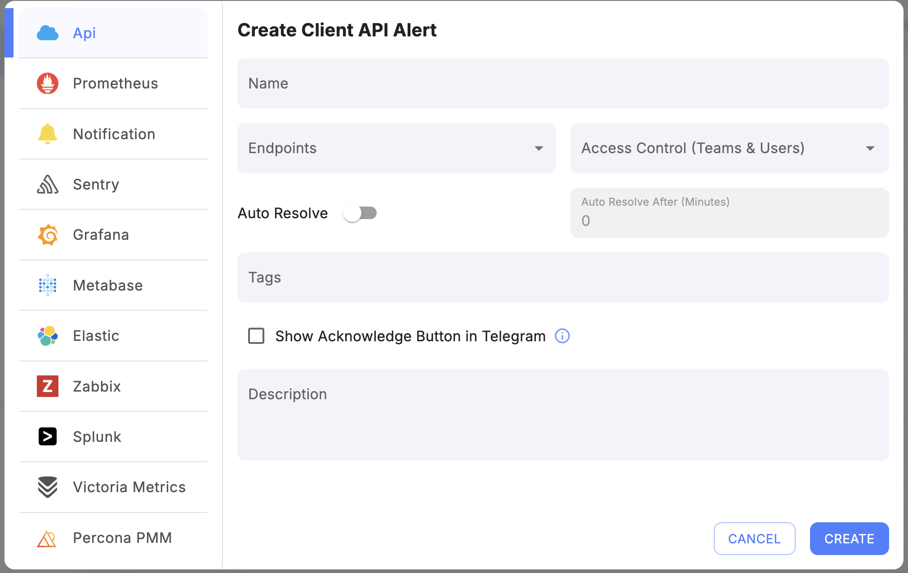
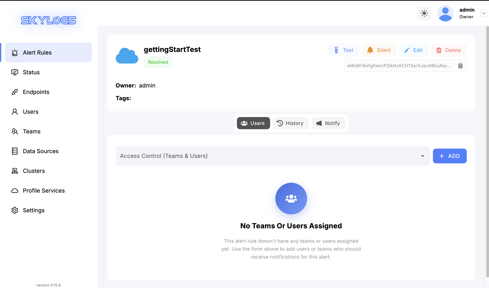

# ⚡ Quick Start

Get **SkyLogs up and running in under 5 minutes** and receive your first alert notification.

This guide focuses only on the fastest possible path to success.

No Prometheus.  
No Kubernetes.  
No email/SMS configuration.  

We will simply:

1. Run SkyLogs with Docker
2. Add a Discord notifier (free & instant)
3. Create an API alert
4. Fire the alert and receive a notification

---

## Requirements

Make sure you have:

- Docker
- Docker Compose
- Git
- Internet access (to pull images)

---

# Step 1 — Clone the Repository

```bash
git clone https://github.com/skylogsio/skylogs.git
cd skylogs
```

# Step 2: Start Docker Containers

#### Using Stable Release (Recommended)

```bash
# Pull and start all services
docker compose up -d
```

This command will:

- Download all required Docker images
- Create and start all containers (application, database, Redis)
- Set up the network between services

#### Using Latest Version (Development)

If you want to use the latest version of Skylogs with the most recent features:

```bash
# Build and start all services from source
docker compose -f docker-compose-build.yml up -d
```

:::caution
The latest version may contain experimental features and is recommended for development or testing environments.
:::


### Step 3: Access Skylogs

Open your web browser and navigate to:

```
http://localhost:8080
```

Login with the default credentials:

- **Username**: `admin`
- **Password**: `SkylogsAdmin`

:::warning
For security reasons, please change the default password immediately after your first login.
:::

## Next Steps

# After Successful Installation

## Create a Discord Endpoint
1. Go to the **Endpoints** tab and click **Create**.  
2. Select **Discord** as the endpoint type.  
3. Paste your **Discord webhook URL** into the value field.  
4. Enter an optional **name** for the endpoint.  
5. Click **Create**.

Your endpoint is now ready to be used for alert notifications.




---

## Create an API Alert Rule
1. Go to the **Alert Rules** tab and click **Create**.  
2. From the left panel, select **API**.  
3. Enter a **name** for the alert.  
4. Assign the **endpoint** you created in the previous step.  
5. Click **Create**.

You now have an API-based alert that can be **fired** and **resolved** using the SkyLogs API.





---

## Test the Alert
1. From the **Alert Rules** page, click on your alert to open the **Alert View** page.  
2. Copy the **Fire** curl command and run it in your terminal.  
   - The alert should move to the **Firing** state.  
   - A notification will be sent to your Discord endpoint.  

   the fire alert is supposed to be like this: 
```bash
curl -X POST http://localhost:8080/api/v1/fire-alert -H 'Content-Type: application/json' -d '{ 
"alertname":"YourAlertName", 
"instance": "test", 
"description": "test description"
}'
```
3. Then copy and run the **Resolve** curl command.  
   - The alert status will change to **Resolved**.  
   - A resolve notification will be sent to Discord.

the resove alert is supposed to be like this: 
```bash
curl -X POST http://localhost:8080/api/v1/stop-alert -H 'Content-Type: application/json' -d '{ 
"alertname":"YourAlertName", 
"instance": "test", 
"description": "test description"
}'
```
---

Your alerting workflow is now fully functional.


If you encounter issues:

- Visit [GitHub Issues](https://github.com/skylogsio/skylogs/issues)
- Email: [support@skylogs.io](mailto:support@skylogs.io)
